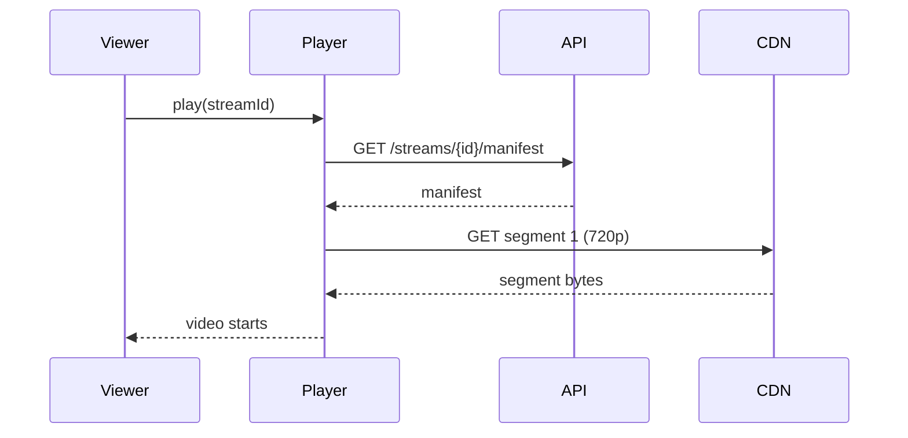

# Sequence UML diagram

A **sequence diagram** shows the **order of calls** between parts for one action.

```mermaid
sequenceDiagram
  Viewer->>Player: play(streamId)
  Player->>API: GET /streams/{id}/manifest
  API-->>Player: manifest
  Player->>CDN: GET segment 1 (720p)
  CDN-->>Player: segment bytes
  Player-->>Viewer: video starts
```

Use it to find missing steps and error cases: *what if the CDN times out?*
